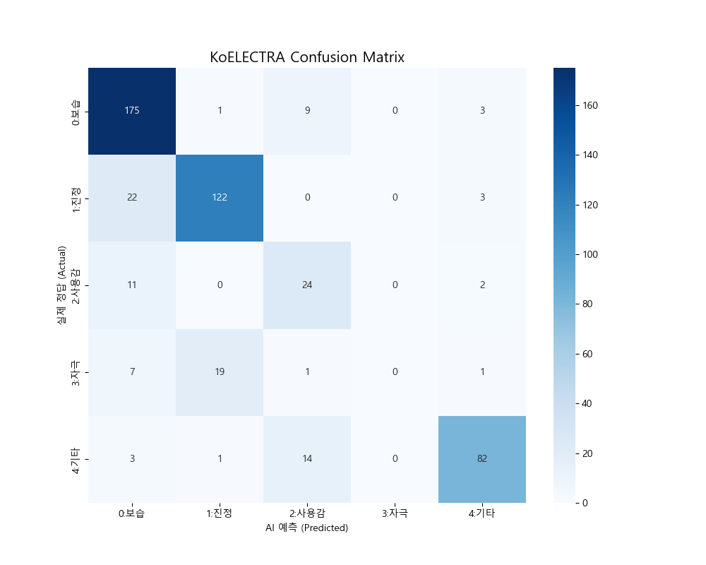
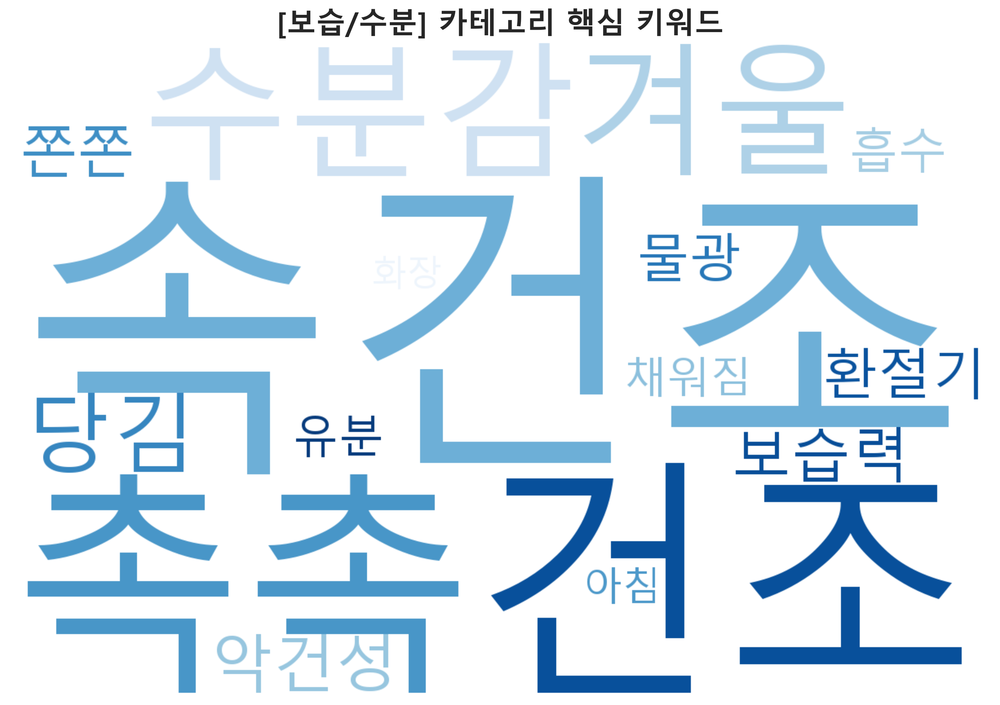
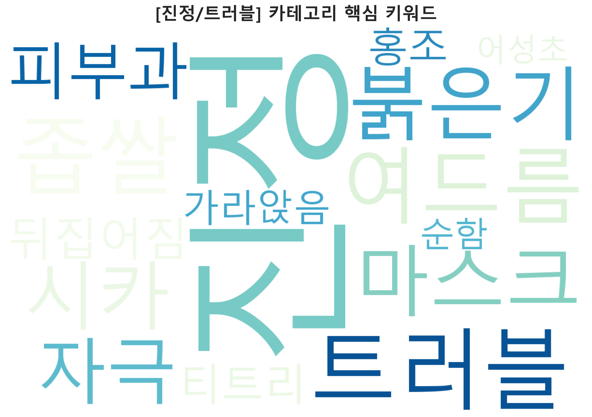
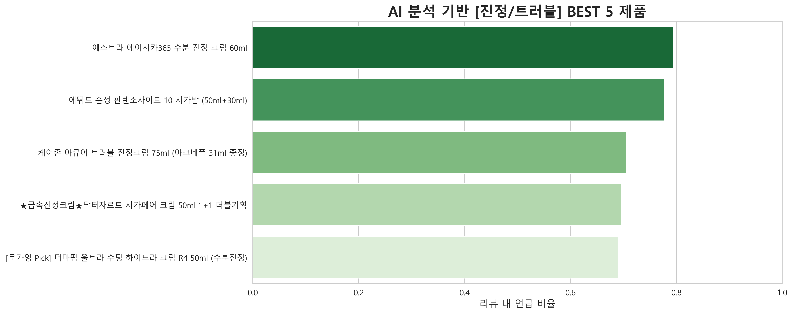
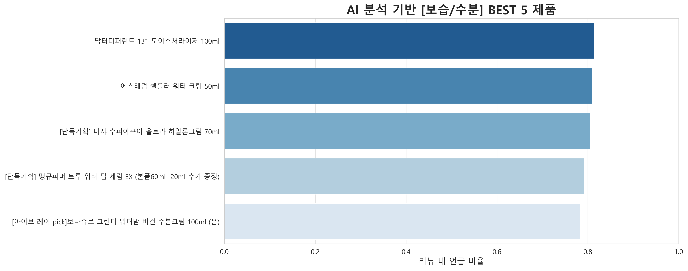

#  올리브영 리뷰 분석을 통한 피부 고민별 맞춤 화장품 추천 프로젝트
> **KoELECTRA 기반의 리뷰 분류 및 BERTopic 토픽 모델링**

   

## 📌 1. 프로젝트 개요 (Overview)
* **프로젝트명**: 올리브영 리뷰 데이터 분석을 통한 맞춤형 스킨케어 인사이트 도출

## 📌 2. 대용량 데이터 저장소
* **구글드라이브주소**: https://drive.google.com/drive/folders/16iDWNRGRV3p_oI1JLGJ9MXyGEnriKlk8?hl=ko

### 🎯 기획 의도
단순한 별점(1~5점)만으로는 알기 힘든 **구체적인 피부 효능(보습, 진정 등)**과 **실사용감**을 파악하기 위해 기획되었습니다.
약 13만 건의 리뷰 데이터를 AI 모델(**KoELECTRA**)로 분석하여, 사용자의 피부 고민에 맞는 최적의 제품을 추천합니다.

---

## 🛠️ 2. 사용 기술 (Tech Stack)

| 구분 | 기술 스택 |
| :--- | :--- |
| **Data Collection** | `Selenium`, `BeautifulSoup` |
| **Data Processing** | `Pandas`, `NumPy`, `OpenPyXL` (Excel handling) |
| **AI Modeling** | **`KoELECTRA`** (monologg/koelectra-base-v3-discriminator), `PyTorch` |
| **Topic Modeling** | **`BERTopic`** |
| **Visualization** | `Matplotlib`, `Seaborn` |
| **Environment** | `Jupyter Notebook`, `CUDA 12.1` |

---

## 📊 3. 분석 프로세스 및 결과 (Process & Results)

### ① 데이터 분포 확인 (Data Distribution)
수집된 리뷰 데이터를 분석한 결과, 소비자들이 가장 중요하게 고려하는 요소는 **'보습'과 '진정'**인 것으로 나타났습니다.


### ② 모델 성능 평가 (Model Evaluation)
**최종 검증 정확도(Validation Accuracy): 81.05%**

한국어 문맥 이해에 특화된 `KoELECTRA` 모델을 파인튜닝하여, 주관적인 리뷰 텍스트에서도 높은 분류 성능을 확보했습니다. 아래 혼동 행렬(Confusion Matrix)을 통해 각 카테고리별 예측 성능을 확인할 수 있습니다.



| Epoch | Train Loss | Train Acc | Val Loss | Val Acc |
| :---: | :---: | :---: | :---: | :---: |
| 1 | 1.3339 | 43.55% | 1.0890 | 63.87% |
| 2 | 0.8286 | 74.85% | 0.7000 | 76.95% |
| **3** | **0.6122** | **79.05%** | **0.5684** | **81.05%** |

### ③ 토픽 모델링 (Topic Modeling)
`BERTopic`을 활용하여 주요 카테고리 내에서 소비자들이 자주 언급하는 세부 키워드를 추출했습니다.

| **Topic 0: 진정/트러블 관련** | **Topic 1: 보습/계절 관련** |
| :---: | :---: |
|  |  |
| '좁쌀', '붉은기', '마스크', '패드' 등 | '속건조', '겨울', '악건성', '수분감' 등 |

### ④ 최종 제품 추천 랭킹 (Product Ranking)
리뷰 텍스트 분석 점수를 기반으로 각 피부 고민 해결에 가장 효과적인 제품을 선정했습니다.

#### 🏆 [진정/트러블] 케어 BEST

* **1위**: 닥터지 레드 블레미쉬 클리어 수딩크림

#### 🏆 [보습/수분] 케어 BEST

* **1위**: 피지오겔 레드 수딩 AI 크림

---

## 📂 4. 폴더 구조 (Directory Structure)

```bash
📦 Cosmetics_Project
 ┣ 📂 data
 ┃ ┣ 📂 01_raw             # 크롤링 원본 데이터
 ┃ ┣ 📂 02_processed       # 전처리 완료 데이터
 ┃ ┗ 📂 03_final           # 모델 학습용 데이터
 ┣ 📂 models
 ┃ ┗ 📂 koelectra_finetuned # 학습된 모델 가중치 (.pt)
 ┣ 📂 notebooks
 ┃ ┣ 📜 01_Crawling.ipynb       # 데이터 수집
 ┃ ┣ 📜 02_Preprocessing.ipynb  # 전처리
 ┃ ┣ 📜 03_Model_KoELECTRA.ipynb # 모델 학습 (Main)
 ┃ ┣ 📜 04_Inference.ipynb      # 추론
 ┃ ┣ 📜 05_Topic_Modeling.ipynb # BERTopic 분석
 ┃ ┣ 📜 06_Visualization.ipynb  # 결과 시각화
 ┃ ┗ 📂 results                 # 결과 이미지 폴더
 ┗ 📜 README.md                 # 프로젝트 설명서
