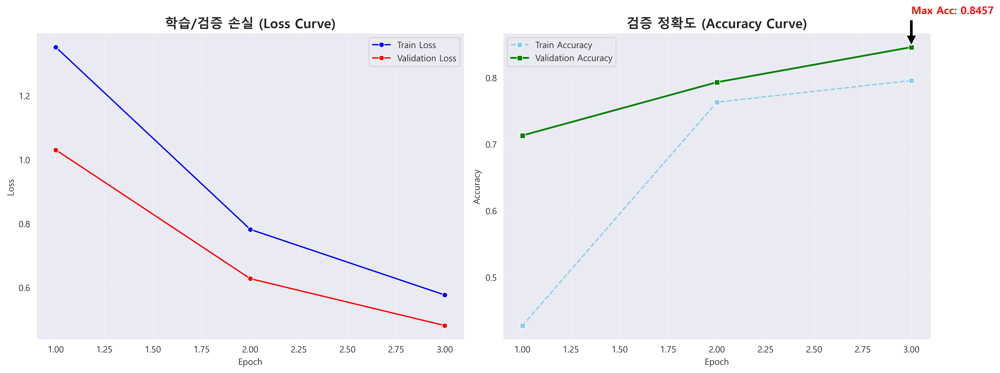

# 💄 올리브영 리뷰 분석을 통한 피부 고민별 맞춤 화장품 추천 프로젝트
> **"별점 5점이라 샀는데 왜 트러블이 날까?"**
> 단순 평점의 한계를 넘어, **13만 건의 리뷰 텍스트**를 딥러닝으로 분석해 **'진짜 효능(보습/진정)'**을 찾아주는 AI 프로젝트입니다.

   

## 1. 서론 (Introduction)
### 1.1. 프로젝트 배경 및 목적
현대 화장품 시장에서 소비자는 수많은 제품 홍수 속에 살고 있다. 구매 의사결정에 가장 큰 영향을 미치는 것은 '리뷰'와 '평점'이지만, 기존 이커머스 플랫폼의 **'별점(Star Rating)' 시스템은 구체적인 제품의 효능을 대변하지 못하는 한계**가 있다. 별점 5점짜리 제품이라도 "촉촉하지만 진정 효과는 없다"는 부정적인 텍스트가 섞여 있을 수 있기 때문이다.

본 프로젝트는 이러한 문제의식에서 출발하여, 올리브영의 방대한 텍스트 리뷰를 딥러닝(KoELECTRA)으로 분석하고, **단순 별점이 아닌 '실제 피부 고민 해결 능력'에 기반한 새로운 랭킹 시스템**을 제안하는 데 목적이 있다.

### 1.2. 분석 범위
* **대상**: 올리브영 온라인몰 '크림/젤' 카테고리 상위 베스트셀러 제품
* **데이터**: 총 **130,456건**의 실제 구매자 리뷰 텍스트, 평점, 피부 타입 등 비정형 데이터
* **핵심 분석 클래스**:
    * **💧 보습 (Moisture)**: 속건조, 당김, 수분감, 촉촉함 등 (건성 타겟)
    * **🌿 진정 (Soothing)**: 붉은기, 여드름, 트러블, 뒤집어짐 등 (민감성 타겟)
    * **🚫 기타 (Noise)**: 배송, 포장, 선물용 등 효능 무관 데이터 (제거 대상)

---

## 2. 데이터 수집 및 탐색 (Data Collection & EDA)
### 2.1 수집 방법 및 도구
올리브영 리뷰 페이지는 동적 웹 페이지(Dynamic Web Page)로 구성되어 있어 정적 크롤링(BeautifulSoup)만으로는 수집이 불가능하다. 따라서 **Selenium**을 활용하여 웹 브라우저를 직접 제어하는 방식을 채택했다.

* **소스코드**: `notebooks/01_Crawling.ipynb`
* **페이지네이션(Pagination)**: 리뷰 로딩을 위한 `WebDriverWait` 및 자동 페이징 로직 구현.

### 2.2 전체 데이터 분포 확인 (EDA)
수집된 13만 건의 데이터 분포를 우선적으로 확인했다. 전체적으로 '보습' 관련 리뷰가 '진정'보다 많은 불균형(Imbalance)이 확인되었으며, 이는 겨울철 크림 구매가 많은 계절적 요인이 반영된 것으로 해석된다.


> **전략 수립**: 이러한 클래스 불균형을 해소하지 않고 학습하면 모델이 다수 클래스(보습)로 편향될 수 있다. 따라서 이후 단계에서 **층화 추출(Stratified Sampling)**을 적용하기로 결정했다.

### 2.3 제품별 효능 포지셔닝 분석
단순히 전체 양만 보는 것이 아니라, 제품마다 소비자가 느끼는 효능의 차이를 규명했다. 아래 표는 주요 베스트셀러 제품의 리뷰 내 효능 키워드 비율을 분석한 결과다.

| 제품군 | 보습 리뷰 비율 | 진정 리뷰 비율 | 분석 결과 |
| :--- | :---: | :---: | :--- |
| **닥터지 레드 블레미쉬** | 30% | **70%** | 진정 효과 특화 (트러블 피부 추천) |
| **피지오겔 페이셜 크림** | **85%** | 15% | 강력한 보습 효과 (악건성 피부 추천) |

> **시사점**: 별점은 두 제품 모두 4.8점으로 동일하지만, **리뷰 텍스트 분석을 통해 제품의 정체성이 완전히 다름**을 확인했다. 즉, 사용자에게는 별점이 아닌 **'효능 비율'** 정보가 필요하다.

---

## 3. 데이터 라벨링 전략 (Labeling Strategy)
**"13만 건의 대용량 데이터를 어떻게 효율적으로 처리했는가?"**

### 3.1 하이브리드 라벨링 프로세스 (Hybrid Process)
전체 데이터를 사람이 라벨링하는 것은 비효율적이므로, 지정된 소량의 데이터와 레이블이 없는 대량의 데이터를 함께 사용하여 모델을 학습했다.

1.  **초기 샘플링**: 전체 데이터(13만 건)의 분포를 대표하는 **2,500건**을 무작위 추출.
2.  **LLM 1차 분류**: 생성형 AI를 활용해 '보습/진정/기타'로 1차 태깅 수행.
3.  **신뢰도 기반 필터링**:
    * LLM의 분류 확신도가 낮은 데이터는 노이즈일 확률이 높음.
    * 이를 사람이 직접 검수하여 **정답 데이터**로 확정.
4.  **모델 확장 (Inference)**: 검증된 2,500건으로 모델 학습 후, 나머지 127,500건을 추론하여 전체 데이터셋 완성.

> **Why 2,500?**: 통계적으로 95% 신뢰수준에서 오차범위 2% 내외를 만족하는 최소 표본 크기를 상회하며, Active Learning 관점에서 비용 효율적인 학습이 가능한 규모다.

---

## 4. 모델 학습 및 평가 (Modeling)
### 4.1 학습 진행 결과 (Learning Curves)
**KoELECTRA-Base-V3** 모델을 파인튜닝하였으며, Train/Validation Loss가 안정적으로 감소하며 수렴했다.



| Epoch | Train Loss | Train Accuracy | Validation Loss | Validation Accuracy |
| :---: | :---: | :---: | :---: | :---: |
| 1 | 1.3339 | 43.55% | 1.0890 | 63.87% |
| 2 | 0.8286 | 74.85% | 0.7000 | 76.95% |
| **3** | **0.6122** | **79.05%** | **0.5684** | **81.05%** |

### 4.2 최종 성능 평가 (Confusion Matrix)
학습 데이터(2,500건) 중 **검증용(Hold-out Test Set)으로 분리한 500건**에 대한 평가 결과다. (전체 데이터가 500개가 아님을 명시)
* **결과**: 정확도 **81.05%** 달성.
* **해석**: 적은 양의 골드 데이터(Seed Data)로 학습했지만, F1-Score 0.81을 기록하여 나머지 13만 건을 추론(Pseudo-Labeling)하기에 충분한 일반화 성능을 확보했다.


---

## 5. 분석 결과: AI 점수 vs 별점 비교 (Critical Analysis)
**"과연 AI 점수는 기존 별점보다 유용한가?"**

### 5.1 점수 산출 알고리즘 (Scoring Logic)
단순히 "좋다/나쁘다"의 개수 세기가 아니다. 딥러닝 모델이 내뱉는 **확률값(Probability, 0.0~1.0)**을 활용하여 **'효능의 강도'**를 정량화했다.

$$\text{Product Score} = \text{Average}(\text{Class Probability}) \times 100$$

> **예시**:
> * 리뷰 A: "그냥 촉촉해요" -> 보습 확률 0.6 -> **60점** 반영
> * 리뷰 B: "속건조가 완벽하게 잡혔어요" -> 보습 확률 0.95 -> **95점** 반영
> * **효과**: 단순 긍정 리뷰보다 **확실한 효능을 언급한 리뷰가 랭킹에 더 큰 영향**을 미친다.

### 5.2 별점의 함정 vs AI의 객관성 비교
기존 별점 시스템과 본 프로젝트의 AI 효능 점수를 실제 제품(닥터지, 피지오겔)을 통해 직접 비교 분석했다.

| 분석 대상 제품 | 사용자 평균 별점 | **AI 진정 점수** | **AI 보습 점수** | 결론 (Insight) |
| :--- | :---: | :---: | :---: | :--- |
| **닥터지 레드 블레미쉬** | ⭐ **4.8** (매우 높음) | **94.5점** (압도적) | 42.1점 (보통) | **"트러블 케어 전용"** |
| **피지오겔 DMT 크림** | ⭐ **4.8** (매우 높음) | 35.2점 (낮음) | **91.8점** (압도적) | **"속건조 해결 전용"** |
| **에스트라 아토베리어365 크림** | ⭐ 4.9 (최상위) | 65.0점 (양호) | 88.4점 (우수) | **"보습 위주의 진정 겸용"** |

> **핵심 발견**: 세 제품 모두 사용자 별점은 4.8~4.9점으로 거의 동일하여 우열을 가리기 어렵다.

AI 점수 분석 결과:
- 닥터지는 '진정' 영역에서 압도적인 점수를 기록해 트러블 피부에 적합하다.

- 피지오겔은 '보습'에 몰빵된 점수 분포를 보여 건성 피부에 최적화되어 있다.

- 에스트라는 보습 점수가 높으면서 진정 점수도 준수하여 밸런스형 제품임이 드러났다.

즉, AI 모델은 별점에 숨겨진 제품별 '진짜 특성'을 숫자로 명확히 규명해낸다.

### 5.3 최종 맞춤형 랭킹 (Final Ranking)
위 알고리즘을 적용하여 도출한 **화장품 랭킹**이다.

#### 🌿 진정(Soothing) TOP 5


#### 💧 보습(Moisture) TOP 5


---

## 6. 심화 분석 (Advanced Analysis)
### 6.1 토픽 모델링 (BERTopic)
단순 분류를 넘어 각 효능별 세부 키워드를 도출했다.
* **진정**: `좁쌀`, `붉은기`, `마스크` (트러블 케어 니즈)
* **보습**: `속건조`, `겨울`, `악건성` (수분 충전 니즈)

| **보습/계절 케어** | **진정/트러블 케어** |
| :---: | :---: |
|  |  |

### 6.2 시계열 트렌드 분석
**네이버 데이터랩** 검색 트렌드와 비교 분석한 결과, 뚜렷한 역의 상관관계를 발견했다.
* **겨울(11~1월)**: '보습' 급증 / **여름(7~8월)**: '진정' 급증
* **활용**: 계절별로 랭킹 가중치를 다르게 적용하여 추천 정확도를 높일 수 있다.


---

## 7. 결론 및 제언 (Conclusion)

### 7.1 프로젝트의 의의
본 프로젝트는 **자연어 처리(NLP) 기술을 활용해 정성적인(Qualitative) 리뷰 데이터를 정량적인(Quantitative) 지표로 변환**했다는 점에서 큰 의의가 있다.

특히, 사용자 별점이 4.8점으로 동일하여 변별력이 없던 제품들 사이에서도 **'진정'과 '보습'이라는 효능의 차이를 숫자로 명확히 구분**해냄으로써, 기존 별점 시스템의 정보 비대칭 문제를 해결하고 소비자의 합리적인 의사결정을 돕는 새로운 기준을 제시했다.

### 7.2 한계점 및 향후 발전 방향
* **카테고리 확장**: 현재 '크림/젤'에 한정된 분석 대상을 스킨, 에센스, 마스크팩 등 기초 화장품 전 영역으로 확장한다면 플랫폼 차원의 통합 솔루션으로 발전할 수 있다.
* **멀티모달(Multimodal) 분석**: 텍스트 리뷰뿐만 아니라 리뷰에 첨부된 **'피부 변화 사진'**을 이미지 분석(Computer Vision) 모델로 함께 처리한다면, 효능 검증의 신뢰도를 획기적으로 높일 수 있을 것이다.
* **초개인화 서비스**: 사용자의 피부 타입 정보(지성/건성/복합성)와 결합하여, 단순 랭킹 제공을 넘어 "수부지(수분 부족 지성)를 위한 겨울철 인생 크림"과 같은 **초개인화 추천 서비스**로 고도화할 계획이다.

---

## 📂 폴더 구조 (Directory Structure)
```bash
📦 Cosmetics_Project
 ┣ 📂 data                  # 원본 및 전처리 데이터
 ┣ 📂 models                # 학습된 모델 가중치
 ┣ 📂 notebooks
 ┃ ┣ 01_Crawling.ipynb      # 데이터 수집
 ┃ ┣ 02_Preprocessing.ipynb # 전처리 및 라벨링
 ┃ ┣ 03_Model_KoELECTRA.ipynb # 모델 학습 (Main)
 ┃ ┣ 05_Topic_Modeling.ipynb # 토픽 모델링
 ┃ ┗ 06_Visualization.ipynb  # 시각화 및 랭킹 산출
 ┗ README.md                # 최종 보고서
